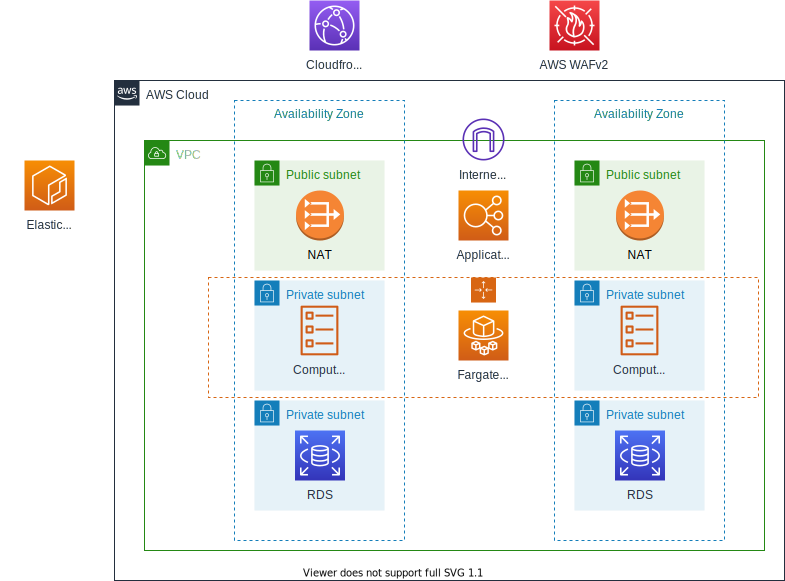

# Введение
## О проекте
Целью текущего проекта является развертывание приложения в отказоустойчивой масштабируемой инфраструктуре на платформе Amazon Web Services.

* ECS Fargate
* ECR
* VPC
* ELB 
* RDS
* CloudFront
* AWS WAFv2

Вышеуказанный перечень сервисов является достаточным для выполнения задания, однако нет необходимости использовать все сервисы одновременно. 

## Описание приложения

Приложение представляется из себя небольшой веб-север. При необходимости переменные можете задать в файле config.yml, такие как имя таблицы, путь до кластера Redis. Для проверки работоспособности приложения можете использовать страницу /status.

Для оценки здоровья сервера другими сервисами? можете использовать страницу /health.

# Референсная архитектура

## Scalling policy
* Min instances: 1 
* Max: 4 
* Desired: 1 
* Scaling Policy: target  
  * Responses per instance: 20 
  * Warm: 120sec 
  * Cooldown: 120 sec 
 
## База даных
База данных проходит две функциональные проверки:
  * Ping до базы данных по укзанным в конфге Host, Port, Username, Password.
  * Попытка создать и прочитать запись в указанной в конфиге таблице.
  Таблица имеет следующую стркутуру (без автоинкремента):
  

  | Field    | Type         | Null | Key | Default | Extra |
  |----------|--------------|------|-----|---------|-------|
  | recordId | varchar(256) | YES  |     | NULL    |       |

